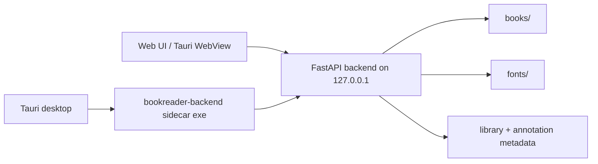

# BookReader Agent Handoff

Last updated: 2026-06-22

## Project State

BookReader is a local reader for TXT, EPUB, and ZIP/comic files. It has a FastAPI backend, React/Vite web frontend, and Tauri v2 desktop shell that launches a PyInstaller-built Python sidecar.

The old March 2026 clean-stack migration is complete. Do not treat `legacy/` migration tasks as active work. Current work should focus on reader stability, EPUB/TXT correctness, packaging reliability, and release smoke testing.

## Main Paths

| Path | Purpose |
| --- | --- |
| `backend/` | FastAPI app, routers, services, PyInstaller sidecar spec/build scripts |
| `frontend/` | React/Vite frontend and tests |
| `frontend/src-tauri/` | Tauri v2 desktop app, config, capabilities, sidecar binaries |
| `docs/` | Build, QA, performance, and regression guardrail docs |
| `tasks/todo.md` | Current build-readiness checklist |
| `tasks/lessons.md` | Implementation lessons and regression notes |

## Runtime Architecture



## Implemented Capabilities

- Library upload/list/delete for TXT, EPUB, and ZIP.
- TXT segmented loading, transform options, measured pagination, search, bookmarks, annotations, and progress persistence.
- EPUB TOC/chapter loading, asset URL rewriting, custom font handling, sanitized chapter HTML rendering, search, annotations, and pagination.
- ZIP image listing and single/dual image viewing.
- Reader settings: theme, font mode/family, margins, line height, letter spacing, layout.
- Desktop packaging through Tauri v2 and PyInstaller sidecar.

## Run Commands

Backend:

```powershell
cd C:\dev\bookreader\backend
pip install -r requirements-dev.txt
python run_server.py --host 127.0.0.1 --port 8000
```

Frontend:

```powershell
cd C:\dev\bookreader\frontend
npm install
npm run dev
```

Desktop:

```powershell
cd C:\dev\bookreader\frontend
npm run desktop:dev
npm run desktop:info
npm run desktop:sidecar
npm run desktop:build
```

## Verification Baseline

Use these before claiming the project is build-ready:

```powershell
cd C:\dev\bookreader
python -m pytest backend/tests -q

cd C:\dev\bookreader\frontend
cmd /c npm run test
cmd /c npm run build
cmd /c npm run desktop:info
cmd /c npm run desktop:sidecar
```

For a release candidate, also run `npm run desktop:build` and manually smoke the installed app.

## Current Known Issues

- Frontend tests intentionally disable Vitest file parallelism because several reader tests share jsdom browser mocks and global fetch/observer state.
- Tauri and related Rust/JS packages are slightly behind the latest versions reported by `desktop:info`.
- PyInstaller warning output still contains many optional imports from platform-specific or optional dependencies; current sidecar health smoke passes.
- Installed-app API smoke and visual WebView smoke have passed. Repeat from fresh app data before publishing a final installer.

## Recent Build-Readiness Notes

- Frontend tests passed: 16 files, 92 tests.
- Backend tests passed: 21 tests.
- Web build passed.
- Sidecar build produced `frontend/src-tauri/binaries/bookreader-backend-x86_64-pc-windows-msvc.exe`.
- Packaged sidecar responded to `/api/health` on a temporary local port.
- Local `books/` and `fonts/` are no longer bundled into the sidecar; packaged runs use app data or `BOOKREADER_DATA_DIR`.
- `desktop:build` produced `frontend/src-tauri/target/release/bundle/nsis/BookReader_0.1.1_x64-setup.exe`.
- Installed app smoke reached `/api/health`; a normal window close terminated both PyInstaller sidecar processes.
- Installed app API smoke with isolated `BOOKREADER_DATA_DIR` uploaded TXT/EPUB/ZIP/font samples, verified TXT segments/search, EPUB TOC/chapter/search/asset, ZIP image list/image bytes, annotation create/patch/delete, font list/download, and close cleanup.
- Tauri package updates are deferred for the release-candidate pass; do not introduce `2.11.x` churn before the visual WebView smoke.
- Added `frontend/src/components/EpubReader.test.jsx` to cover EPUB TOC/chapter loading and sanitized chapter rendering.
- Installed visual WebView smoke on 2026-06-22 verified dashboard rendering, TXT body/search/settings/font controls, EPUB image rendering, and ZIP dual-page image rendering.
- Latest sizes: sidecar 19,615,633 bytes, app exe 10,843,136 bytes, installer 21,929,388 bytes.

## Guardrails For Future Agents

- Do not revert unrelated dirty files. This repo often has in-progress generated docs, logs, and local library metadata.
- Prefer focused fixes and regression tests around reader behavior.
- Keep EPUB HTML handling sanitized before any `innerHTML` or `dangerouslySetInnerHTML` path.
- Keep Tauri CSP explicit; do not return it to `null`.
- When trimming PyInstaller imports, always rebuild the sidecar and smoke `/api/health`.
- Keep desktop exit cleanup process-tree aware on Windows because the PyInstaller onefile sidecar launches a worker process.
